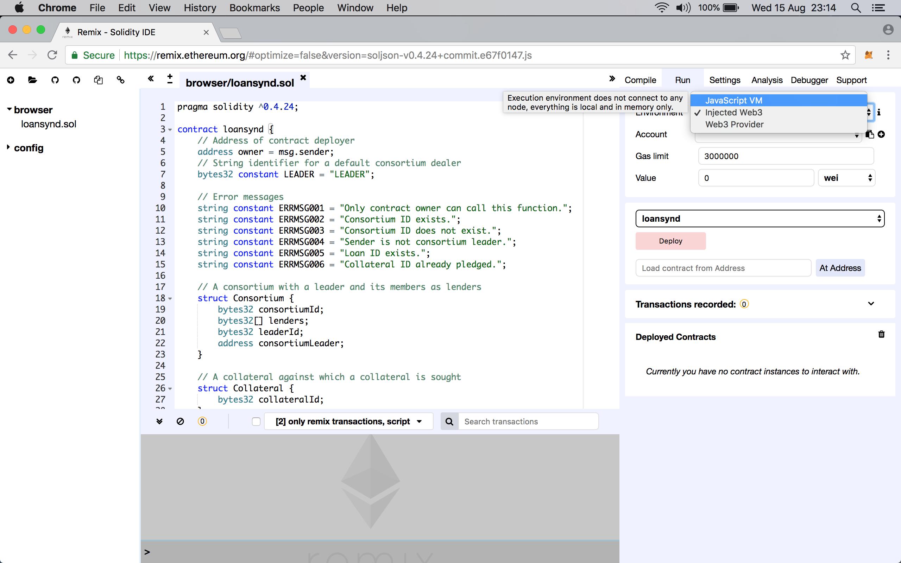
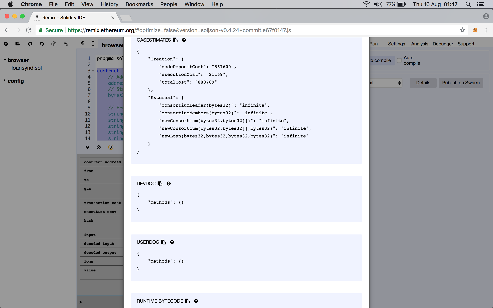
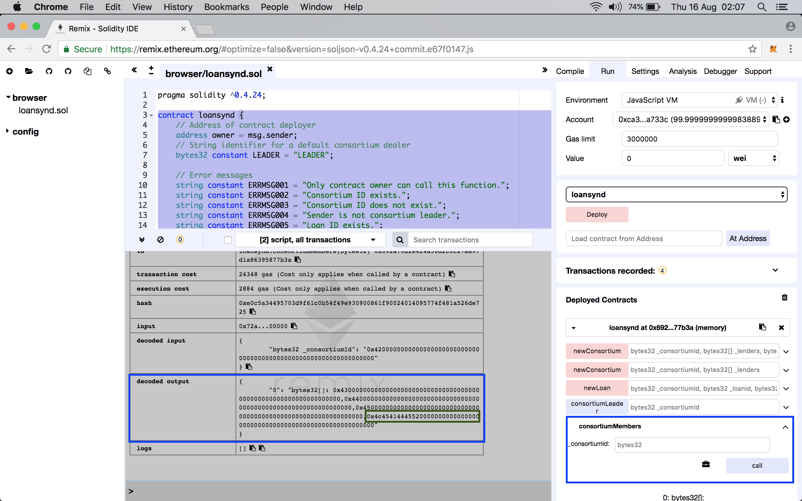
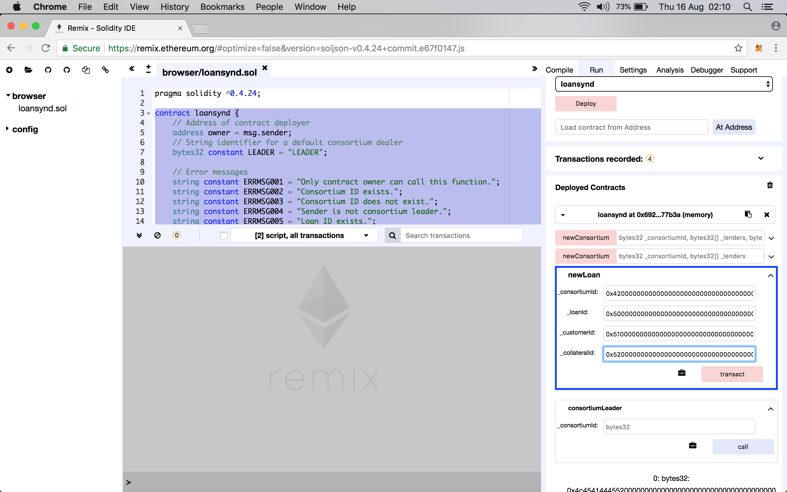
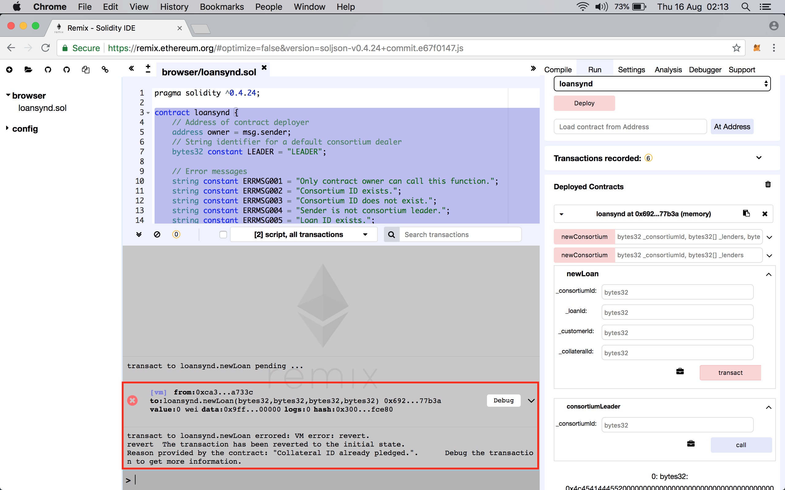

# Introduction

A simple PoC for loan syndication. The scope of this PoC is defined as:

> Loan syndication between a consortium of banks to put the underlying collateral on block-chain to share that information between the consortium to avoid frauds. Leverage the smart contracts to build this prototype.

- [Introduction](#introduction)
  - [Background](#background)
  - [Getting started](#getting-started)
  - [Smart Contract demo](#smart-contract-demo)
    - [Deploy contract](#deploy-contract)
    - [Gas calculation](#gas-calculation)
    - [Test contract](#test-contract)
  - [Smart Contract and AWS infra-structure demo](#smart-contract-and-aws-infra-structure-demo)
  - [Decentralized consensus](#decentralized-consensus)
  - [Solution](#solution)
    - [Infra-structure](#infra-structure)
    - [Consensus algorithm](#consensus-algorithm)
    - [Metamask](#metamask)
  - [Microsoft VS Code](#microsoft-vs-code)
    - [Remix IDE](#remix-ide)
    - [Terminal](#terminal)
  - [Demo walk-through - local](#demo-walk-through---local)
  - [Set-up and start Ethereum network](#set-up-and-start-ethereum-network)
    - [Install `ethereum`](#install-ethereum)
    - [Initial set-up](#initial-set-up)
    - [Create accounts for sealing transactions](#create-accounts-for-sealing-transactions)
    - [Create genesis file](#create-genesis-file)
    - [Initialize Ethereum with the genesis file](#initialize-ethereum-with-the-genesis-file)
    - [Create a boot node and start](#create-a-boot-node-and-start)
    - [Launch nodes](#launch-nodes)
      - [Node1](#node1)
      - [Node2](#node2)
  - [Smart Contract walk-through in VS Code](#smart-contract-walk-through-in-vs-code)
  - [Install Metamask extension](#install-metamask-extension)
  - [Deploy contract with Remix IDE](#deploy-contract-with-remix-ide)
  - [Invoke functions of contract with Remix IDE](#invoke-functions-of-contract-with-remix-ide)

## Background

Loan syndication is defined at [Investopedia](https://www.investopedia.com/terms/l/loansyndication.asp) as follows:

>Loan syndication is the process of involving a group of lenders to fund various portions of a loan for a single borrower. Loan syndication most often occurs when a borrower requires an amount too large for a single lender to provide or when the loan is outside the scope of a lender's risk exposure levels. Thus, multiple lenders form a syndicate to provide the borrower with the requested capital.

In this PoC, we show how, a given collateral is not pledged multiple times within a consortium of lenders or even across consortia. To jump into the demo, go to **Getting Started**.

## Decentralized consensus

The problem of _consensus_ has the following characteristics:

- Two or more parties.
- Parameter of interest.
- Central custodian of the value of the parameter of interest.
- Consensus _enforced_ by the custodian.

With _decentralized consensus_, the characteristics can be redefined as:

- Two or more parties.
- Parameter of interest.
- Network of peers store the value of parameter of interest.
- Consensus arrived via algorithms executed on nodes of a network.

Therefore, we re-write the scope of PoC in terms of decentralized consensus as follows:

- Parties: banks of a consortium and loan applicant.
- Parameter of interest: collateral identifier.
- Value of parameter of interest: collateral pledged for a loan in the past.
- Consensus: Proof of Authority consensus.

## Solution

As follows.

## Getting started

There are two ways to see this PoC in action. First, is a simple demonstration of the Smart Contract without focussing much on underlying infra-structure. Second, an underlying infra-structure on Amazon Web Services (AWS), on to which the Smart Contract is deployed, is described.

> **NOTE**, it is a good practice to save only identifiers or references to actual data on the blockchain. On one hand, this makes the blockchain _light weight_ and on the other, a certain level of privacy is maintained. Therefore, this demo saves the identifiers _only_ on the blockchain. The mechanism to generate and derefernce the identifiers is considered **out of scope**.

## Smart Contract demo

### Deploy contract

For the Smart Contract demo, follow the steps below.

1. Launch https://remix.ethereum.org in a browser.
2. Remove the default `.sol` contract that appears.  
  2.1 On the left hand navigation pane, expand the button for browser.  
  2.2 Delete files appearing there. See 
3. Click the plus icon on the top of left hand navigation pane.
4. Enter file name as `loansynd.sol` and click OK. 
5. Copy all the contents of `loandsynd.sol` from this project into the editor. 
6. Click on **Start to Compile**. (See ). You may see some compilation warnings; they are OK to ignore for this demo.
7. Click on **Run** tab. Ensure that the **Environment** is set to **Javascript VM**. This option helps in quickly testing the contract without focussing on the underlying infra-structure. 
8. Click on **Deploy** button to deploy this contract. 
9. The results of deployment can be seen in screen-shot below.    
  9.1 Since the deployment of the contract is itself a transaction that changes the _world state_ of Ethereum, it has a corresponding a transaction hash as shown in the red box.  
  9.2 Since this transaction is a deployment of a contract, the Remix IDE shows the address where this contract was deployed. This is highlighted in the blue box. Note the trailing two hex digits; they are the same as shown in the blue box on the right hand side navigation pane.  
  9.3 The functions of this contract are shown immediately below it as marked in the orange box.  
  9.4 The same contract and its functions can be displayed by copy-pasting the contract address (see 9.2) into the text field left of **At Address** button and clicking the same.  
  9.5 The address used to deploy this contract is marked in the green boxes. This address is automatically generated and credited with 100 ETH by the Javascript VM for sake of convenience.

### Gas calculation

In the results of deployment, the following can be seen:

1. Gas sent is `3000000`.
2. The transaction cost - as reported in Remix IDE - is `1205713`.
3. The execution cost is `888769`.
4. The transaction cost - as reported in Remix IDE - is inclusive of the execution cost. Therefore, the _actual_ transaction cost is the difference of 2 and 3 above; or, `316944`.

This section explores the figures as reported above.

1. The gas sent is simply the figure that appears immediately below the **Account** field in the right hand side navigation pane.
2. The Appendix for fee schedule in the [Ethereum Yellow Paper](https://ethereum.github.io/yellowpaper/paper.pdf) mentions `200` gas for every byte for `Gcodedeposit` operation. This operation is used for contract creation.
3. On the **Compile** tab, click on **Details** button to see the result of compilation. Scroll down all the way to **Runtime bytecode**. Refer .
4. Click on the icon to copy the displayed JSON and paste into a plain text file. From that file, copy the value of the `object` field and paste into yet another plain text file and save it. Check the number of bytes reported and divide by two for the number of bytes in contract creation. It should be `4338`.
5. Multiply the byte count with gas price for contract creation: `4338 * 200 = 867600` to return code deposit cost.
6. In the compilation output details page, there is a section for **Assembly** that shows the operation codes correspoding to this Solidity code. This [handy spreadsheet](https://docs.google.com/spreadsheets/d/1n6mRqkBz3iWcOlRem_mO09GtSKEKrAsfO7Frgx18pNU/edit#gid=0) can be used for calculating the execution cost.
7. A simpler way is to look at the **GASESTIMATES** section in the compiler output (see 3 to locate this output) as shown in the . In that section, we see the value of `executionCost` as `21169`. Adding to this the code deposit cost (see 5) of `867600`, the total execution cost of `888769` is arrived at.
8. Further, the following prices also apply:  
  8.1. A fee of `32000` for `Gtxcreate` which is a contract creating transaction.  
  8.2. A fee of `4` for `Gtxdatazero` for every zero byte of data or code for a transaction.  
  8.3. A fee of `68` for `Gtxdatanonzero` for every non-zero byte of data or code for a transaction.  
  8.4. A fee of `21000` for `Gtransaction` for every transaction.
9. It is tedious to count the number of zero and non-zero bytes in the runtime byte code of `4338` bytes (see 4). Nevertheless, some back calculation can probably help verify.  
  9.1. If `x` is number of zero bytes and `y` the number of non-zero bytes, then `x + y = 4338` and `4x + 68y = 316944 - 32000 - 21000`.  
  9.2 Solving these equations, `x=485` and `y=3853` - reasonable.
10. Finally, post contract deployment, the balance of the address is the difference between `100` ETH (initial) and total transaction cost `1205713 wei`.

### Test contract - new consortium

A new consortium of banks is recorded on the blockchain. In loan syndication, there is a lead banker within a consortium. This Smart Contract provides two options for defining the leader of a consortium. First, the leader is automatically set to the contract deployer _if_ the address creating the consortium is same as that of deployer. Second, the leader maybe manually provided. For sake of simplicity, this document uses the first option.

> The input type is set to `bytes32` so that all entries are prefixed with a `0x` and padded with zeroes for 32 bytes.

1. Refer screen-shot 
2. Click on down arrow against the function `newConsortium` whose signature has two arguments only.
3. The consortium ID is defined simply as `B` which is `0x4200000000000000000000000000000000000000000000000000000000000000` in `bytes32`.
4. Since the `lenders` argument is an array of `bytes32`, the value is input as `["0x00...0000","0x00...0001"]`. Three lenders are considered to be part of this consortium and are simply defined as `C`, `D` and `E`. Therefore, this field is defined as `["0x4300000000000000000000000000000000000000000000000000000000000000","0x4400000000000000000000000000000000000000000000000000000000000000","0x4500000000000000000000000000000000000000000000000000000000000000"]`.
5. Note that, this function will assign the leader of consortium as the address that deployed this contract. So, in all, four lenders will be part of the consortium.
6. Click on **Transact**.

### Test contract - consortium members

1. Refer 

### Test contract - consortium leader

1. Refer 

### Test contract - new loan

1. Refer 

### Test contract - new loan, same collateral

1. Refer 